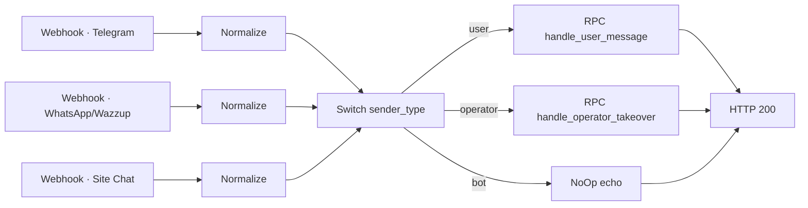
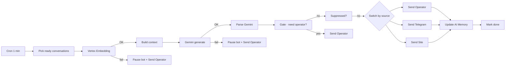
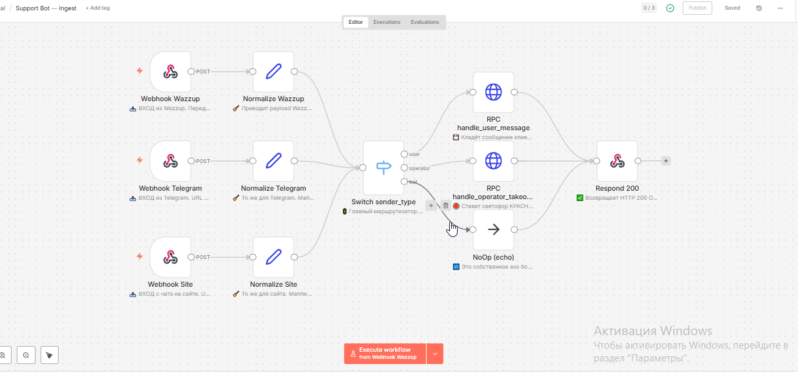
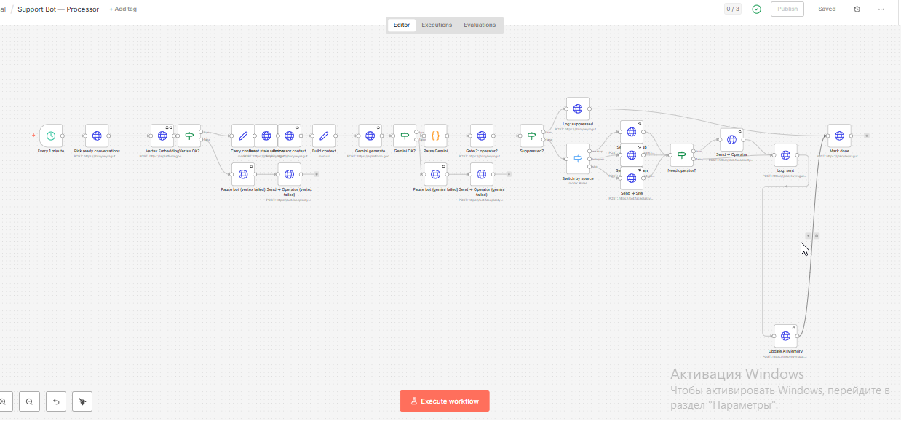

# 01 — AI Support Bot для онлайн-школы

RAG-бот техподдержки с обработкой 3 параллельных каналов (Telegram, WhatsApp, сайт),
двухуровневой защитой от сбоев AI и автоматической передачей оператору.

**Стек:** n8n · Vertex AI Embeddings · Gemini · Supabase · Telegram Bot API · WhatsApp (Wazzup) · Site Chat

---

## Задача

Закрыть типовые вопросы студентов курса 24/7 без участия живых кураторов, при этом:
- не путаться в каналах (студент пишет туда, где ему удобно);
- не терять сообщение при сбое AI-сервисов;
- мгновенно передавать диалог оператору, как только он включился в переписку;
- держать память диалога per-user, чтобы бот не задавал заново уже отвеченные вопросы.

---

## Архитектура

Система декомпозирована на **два независимых workflow'а**, чтобы синхронный ответ webhook'у не зависел от скорости AI:

### Ingest (синхронный, отвечает на webhook за <500мс)

Каждый канал нормализуется к единому формату payload'а, потом Switch роутит по типу отправителя в нужный RPC.
Webhook возвращает HTTP 200 практически мгновенно.

### Processor (асинхронный, cron каждую минуту)

Cron-trigger каждую минуту забирает диалоги, готовые к ответу. Каждая AI-нода имеет
**fallback-ветку**: при сбое Vertex Embedding или Gemini диалог автоматически
передаётся живому оператору, бот ставится на паузу для этого диалога.

---

## Архитектурные решения

| Решение | Почему |
|---|---|
| Ingest и Processor разнесены | Webhook отвечает мгновенно, не дожидаясь AI. Каналы не отваливаются по timeout даже если Gemini тормозит. |
| Cron 1 мин вместо webhook-driven AI | Можно батчить обработку, проще наблюдать в Executions, легко добавлять retry. |
| Fallback на оператора при сбое AI | Лучше передать живому человеку чем потерять сообщение или дать галлюцинацию. |
| Operator takeover gate | Как только оператор написал — бот замолкает в этом диалоге автоматически, без ручной паузы. |
| AI Memory per conversation | Бот помнит контекст диалога между сессиями, не задаёт уже отвеченные вопросы. |
| Suppressed-флаг | Возможность точечно отключить бота в конкретном диалоге, не трогая основной workflow. |

---

## Скриншоты

### Ingest workflow

Единая точка входа для 3 каналов: webhook → нормализация payload'а к общему формату →
Switch по типу отправителя (user / operator / bot) → роутинг в нужный RPC → HTTP 200.

### Processor workflow

AI-пайплайн с fallback-ветками: cron 1 мин → Vertex Embedding (при сбое →
пауза бота + алерт оператору) → сборка контекста → Gemini generate (тот же fallback) →
gate «нужен оператор?» → Switch by source → отправка в правильный канал →
обновление AI-памяти.
