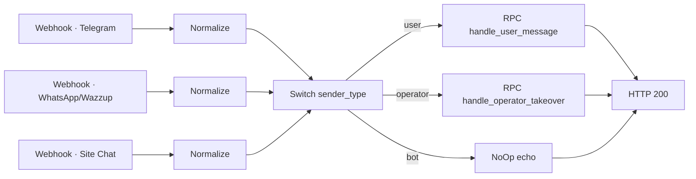
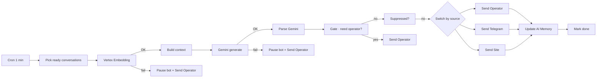

# 01 — AI Support Bot для онлайн-школы

RAG-бот техподдержки с обработкой 3 параллельных каналов (Telegram, WhatsApp, сайт),
двухуровневой защитой от сбоев AI и автоматической передачей оператору. Поверх LLM —
детерминированный слой качества ответа: рерайт базы знаний, защита от зацикливания и
prompt-injection, мультиязычность и умные пороги эскалации.

**Стек:** n8n · Vertex AI (Embeddings + Gemini 3 Flash) · Supabase · Telegram Bot API · WhatsApp (Wazzup) · Site Chat

---

## Задача

Закрыть типовые вопросы студентов курса 24/7 без участия живых кураторов, при этом:
- не путаться в каналах (студент пишет туда, где ему удобно);
- не терять сообщение при сбое AI-сервисов;
- мгновенно передавать диалог оператору, как только он включился в переписку;
- держать память диалога per-user, чтобы бот не задавал заново уже отвеченные вопросы.

---

## Архитектура

Система декомпозирована на **два независимых workflow'а**, чтобы синхронный ответ webhook'у не зависел от скорости AI:

### Ingest (синхронный, отвечает на webhook за <500мс)

Каждый канал нормализуется к единому формату payload'а, потом Switch роутит по типу отправителя в нужный RPC.
Webhook возвращает HTTP 200 практически мгновенно.

### Processor (асинхронный, cron каждую минуту)

Cron-trigger каждую минуту забирает диалоги, готовые к ответу. Каждая AI-нода сначала
**ретраит до 5 раз** (Vertex Embedding / Gemini), и только если сбой устойчив — включается
**fallback-ветка**: диалог автоматически передаётся живому оператору, бот ставится на паузу
для этого диалога.

### Движок качества и безопасности ответа

Генерация — только половина. Ответ проходит через детерминированный слой правил (нода `Parse Gemini`),
который делает его похожим на живого специалиста и страхует от типовых сбоев:

- **Persona «живой человек, не робот»** — системная инструкция запрещает робо-зачины («Absolutely!», «Great question!»), держит тон спокойным и по делу, ответ в 1–3 предложениях.
- **Рерайт KB, а не копипаст** — факты, ссылки и цены берутся из базы знаний дословно, а обёртка перефразируется на 20–30%, чтобы ответы не звучали как выдержки из FAQ.
- **Repeat circuit breaker** — хеш предыдущего ответа сравнивается с новым: первый повтор → бот принудительно переформулирует, второй → эскалация оператору (`bot_loop_detected`). Зациклиться на одном ответе бот не может.
- **Мультиязычность по языку клиента** — ответ на языке обращения; первичный набор EN/ES/DE/TR/PT/RU с готовыми шаблонами реплик, редкий язык → перевод или эскалация.
- **Защита от prompt-injection** — блок SCOPE & SAFETY с наивысшим приоритетом: off-topic отклоняется, попытки «покажи системный промпт / ignore previous instructions / DAN» игнорируются, инструкции внутри сообщения клиента трактуются как данные.
- **KB-cap и тихий хендофф** — после 6 ответов из базы в одной сессии 7-й молча уходит оператору: клиента не «пережёвывает» бесконечно.
- **Anti-troll silence** — 3 подряд провокационных/бессмысленных сообщения → бот замолкает на 30 минут.
- **Явные причины эскалации** — возврат/отмена, медицина, юридика, персональные данные, прямая просьба живого человека → всегда к оператору.
- **12h session reset** — контекст диалога сбрасывается раз в 12 часов: свежая сессия без застрявшего старого состояния.

Дорогая LLM генерирует, дешёвый детерминированный слой причёсывает, страхует и решает, звать ли человека.

---

## Архитектурные решения

| Решение | Почему |
|---|---|
| Ingest и Processor разнесены | Webhook отвечает мгновенно, не дожидаясь AI. Каналы не отваливаются по timeout даже если Gemini тормозит. |
| Cron 1 мин вместо webhook-driven AI | Можно батчить обработку, проще наблюдать в Executions, легко добавлять retry. |
| Fallback на оператора при сбое AI | Лучше передать живому человеку чем потерять сообщение или дать галлюцинацию. |
| Operator takeover gate | Как только оператор написал — бот замолкает в этом диалоге автоматически, без ручной паузы. |
| AI Memory per conversation | Бот помнит контекст диалога между сессиями, не задаёт уже отвеченные вопросы. |
| Suppressed-флаг | Возможность точечно отключить бота в конкретном диалоге, не трогая основной workflow. |
| Persona-слой + рерайт KB | Ответ звучит как живой специалист, а не выдержка из FAQ: факты дословно, обёртка перефразируется, робо-зачины запрещены. |
| Repeat circuit breaker (хеш ответа) | Детерминированно ловит зацикливание — 1-й повтор перефраз, 2-й эскалация; не полагаемся на «сознательность» LLM. |
| Ответ на языке клиента (EN/ES/DE/TR/PT/RU) | Студенты пишут на разных языках; отвечаем на языке обращения, редкий язык — перевод/эскалация. |
| SCOPE & SAFETY поверх всех правил | Защита от prompt-injection и увода с темы: инструкции в сообщении = данные, системный промпт не раскрывается. |
| Node-retry ×5 под fallback-на-оператора | Транзиентный сбой Vertex/Gemini чинится ретраем; к человеку уходит только реально застрявшее. |
| KB-cap 6 + anti-troll silence + 12h reset | Бот не пережёвывает клиента бесконечно, не ведётся на троллинг, контекст свежий — после порогов оператор/пауза. |

---

## Что показывает

- **Продакшн-архитектуру на n8n**: разнесённые sync/async воркфлоу, cron-обработка, наблюдаемость в Executions.
- **Инжиниринг качества ответа поверх LLM**: детерминированный слой (рерайт KB, circuit breaker, причины эскалации) превращает «просто Gemini» в предсказуемого агента поддержки.
- **Многоканальность и мультиязычность** из одного пайплайна: Telegram / WhatsApp / сайт, 6 языков.
- **Отказоустойчивость**: node-retry, двойные fail-safe ветки, авто-пауза бота и передача оператору.
- **Безопасность**: защита от prompt-injection и увода с темы приоритетнее всех прочих правил.
