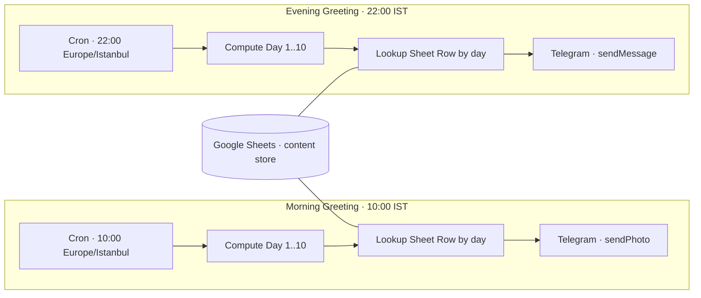

# 02 — Community Curator: Scheduled Greetings

Утренние и вечерние автоматические поздравления в Telegram-сообществе по 10-дневному циклу.
Сознательное архитектурное решение — **вынесены в отдельные workflow'ы** от основного AI-бота сообщества.

**Стек:** n8n · Telegram Bot API · Google Sheets API · Cron (TZ Istanbul)

---

## Задача

Сообщество в TG ожидает от куратора живых утренних и вечерних поздравлений. Куратор —
AI-бот, который основное время решает вопросы участников. Сделать так, чтобы:

- поздравления уходили **точно по расписанию** в нужной timezone,
- тексты и картинки могла редактировать **не-техническая команда** без касания n8n,
- если основной AI-бот упал — поздравления **всё равно ушли**.

---

## Архитектура

Декаплинг через два отдельных workflow'а (utro + vechir), каждый с собственным cron-trigger'ом
и собственным content store:

Каждый workflow:
1. Срабатывает по cron в TZ Istanbul (10:00 для утра, 22:00 для вечера),
2. Вычисляет текущий день 10-дневного цикла,
3. Подтягивает строку из Google Sheet по этому дню,
4. Отправляет в Telegram: утром — фото (sendPhoto), вечером — текст (sendMessage).

---

## Архитектурные решения

| Решение | Почему |
|---|---|
| **Вынесены из основного AI-бота** | Scheduled-задачи не делят runtime с realtime-обработкой сообщений. Если AI-стек падает — поздравления всё равно отправятся. |
| **Google Sheets как content store** | Команда правит тексты и file_id картинок прямо в таблице, без касания n8n. Версионирование строк = архив всех вариантов поздравлений. |
| **10-дневный цикл вместо ежедневных текстов** | Поздравления повторяются раз в 10 дней — это не раздражает аудиторию (вряд ли кто помнит, что писалось 10 дней назад) и сильно экономит контент-работы. |
| **Cron в TZ Istanbul, не UTC** | Получатели — Турция. n8n понимает named timezone напрямую, без ручной коррекции на летнее/зимнее время. |
| **2 разных workflow'а, не один с if-веткой** | Каждый можно остановить, отладить, заменить независимо. Видно в Executions кто и когда отправил. |
