# 03 — AI Instagram Carousel Generator

Batch-генерация Instagram-каруселей по контент-плану из Google Sheets с асинхронной генерацией картинок и chunked-upload'ом в Instagram.

**Стек:** n8n · AI Image Generation API · Google Sheets · Instagram Graph API · CDN storage

---

## Задача

Команда контент-маркетинга ведёт контент-план каруселей в Google Sheets: тема, заголовки слайдов,
структура. Нужно превратить строки в готовые опубликованные карусели в IG без ручной работы дизайнера
для каждого варианта.

Сложности, которые надо было обойти:
- Генерация картинок занимает 10–60 секунд на слайд — нельзя блокировать пайплайн.
- IG Graph API требует chunked upload для каждой картинки + отдельный пост-объект с media-children.
- Image-generation API имеет rate limit.
- При сбое в середине карусели её нельзя просто заново отправить — нужно знать, что уже сгенерировалось.

---

## Архитектура

```mermaid
flowchart LR
  T[Trigger] --> GS[Get rows from Sheet]
  GS --> PB[Prompt Builder per slide]
  PB --> HTTP[HTTP · text-to-image task submit]
  HTTP --> PI[Prepare Image JSON]
  PI --> LOOP{Loop Over Items}
  LOOP --> A[Banner Collection Track]
  LOOP --> B[Image Generation Track]
  A --> A1[Collect Banner Result]
  A1 --> A2{All collected?}
  A2 -->|yes| A3[Prepare Elements Update]
  A3 --> A4[Google Sheets Write payload]
  B --> B1[Create Image Task · async submit]
  B1 --> B2[Refresh Image URL]
  B2 --> B3{Image Ready?}
  B3 -->|no, wait| B2
  B3 -->|yes| B4[Download Image]
  B4 --> B5[Init Upload Post · IG]
  B5 --> B6[Chunk Upload]
  B6 --> B7{Upload Post Ready?}
  B7 --> B8[Calculate Upload Status]
  B8 --> B9[Upload to Banner Storage]
  B9 --> A1
  LOOP --> ERR[Build Banner Error Result]
  ERR --> RL[Rate-Limit Delay]
```

Внутри Loop Over Items идут **два параллельных трека**:

1. **Banner collection track** — собирает уже готовые картинки слайдов, проверяет gate «все собраны?», и когда да — пишет финальный payload обратно в Google Sheet (что карусель опубликована, что её ID такой-то).

2. **Image generation track** — async-submit задачи в image API, потом polling «ready?» с back-off retry'ями, скачивание готовой картинки, chunked upload в Instagram, upload в banner storage (CDN), возврат результата в первый трек.

Отдельная error-ветка с rate-limit delay реагирует на 429 от image API и не валит весь батч.

---

## Архитектурные решения

| Решение | Почему |
|---|---|
| **Async polling вместо блокирующего ожидания** | Image API долгий (10–60с/кадр) и нестабильный. Polling позволяет не блокировать n8n thread и видеть progress по каждой задаче в Executions. |
| **Два параллельных трека внутри Loop** | Можно собирать готовые баннеры параллельно с генерацией новых. Карусель готова, как только последняя картинка догрузилась. |
| **Chunked upload в Instagram** | IG Graph API требует chunked для больших файлов. Видео и большие картинки иначе не пройдут. |
| **Sheet как orchestration UI** | Контент-команда правит контент-план прямо в таблице, n8n триггерится по «опубликовать» галочке. |
| **Rate-limit delay в error-ветке** | При 429 от image API workflow ждёт N секунд и продолжает, а не валит весь batch. |
| **CDN storage для банкеров** | Нужен для повторного использования (например, картинка на лендинге = картинка в IG карусели) без ре-генерации. |
