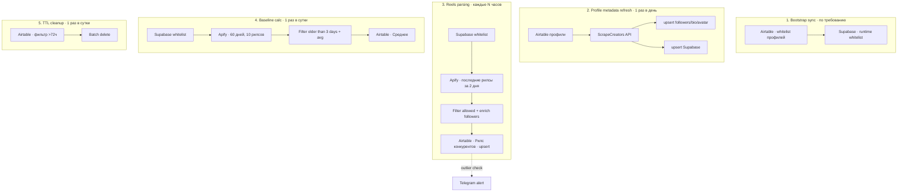

# 04 — Instagram Competitor Reels Tracker

Конкурентная разведка через 5 связанных n8n workflow'ов. Парсер берёт свежие рилсы конкурентов
два раза в день и сравнивает каждый с «личной нормой» аккаунта (среднее по 20 последним рилсам).
Если рилс заметно выше нормы — алерт в Telegram.

**Стек:** n8n · Apify Instagram Scraper · ScrapeCreators API · Airtable · Supabase · Telegram Bot API

---

## Задача

Маркетинг-команда хочет следить за «залётными» рилсами у 20+ конкурентов в нише, но:
- скроллить вручную 20 аккаунтов каждый день — потеря 1–2 часов;
- средний рилс конкурента ничем не интересен, нужны только **выбросы вверх по просмотрам**;
- «выброс» у крупного блогера и у мелкого — это разные абсолютные числа, нужен **personal baseline**.

---

## Архитектура

Система разбита на **5 независимых workflow'ов** с разной частотой запуска:

| WF | Триггер | Что делает |
|---|---|---|
| 1. Bootstrap sync | По требованию (новый конкурент в списке) | Копирует список конкурентов из мастер-Airtable в Supabase runtime whitelist |
| 2. Profile metadata refresh | 1×/день | Через ScrapeCreators API подтягивает followers, био, аватар по каждому профилю |
| 3. Reels parsing | 2–4×/день | Через Apify Instagram Scraper забирает рилсы за последние 2 дня по whitelist'у, обогащает followers'ами из Airtable, делает upsert по reel ID |
| 4. Baseline calc | 1×/день | Через Apify забирает 60-дневную ленту (10 рилсов на профиль), фильтрует «старше 3 дней» (свежий тренд не должен искажать baseline), считает среднее, пишет в отдельную Airtable-таблицу |
| 5. TTL cleanup | 1×/день | Удаляет из «Рилс конкурентов» всё что старше 72 часов через Airtable formula filter |

Outlier detection живёт в Airtable formula поверх данных из WF3 + WF4: если `views / baseline > threshold` —
триггерится TG-алерт со ссылкой на рилс.

---

## Архитектурные решения

| Решение | Почему |
|---|---|
| **5 разных workflow'ов вместо одного монолитного** | Каждый можно запускать с разной частотой. Можно отдельно перезапустить baseline calc если поломали алгоритм, не трогая парсинг. |
| **Два источника данных** (Apify + ScrapeCreators) | Apify даёт рилсы, ScrapeCreators даёт профили. У ScrapeCreators богаче метаданные профиля (био, followers), у Apify лучше с lentой постов. Если один сервис упал — второй продолжает. |
| **Airtable + Supabase, не один store** | Airtable — UI для маркетинга (правят список конкурентов, смотрят отчёты). Supabase — runtime whitelist для парсера (быстрее SQL-запросы, не блочит маркетинговый UI). |
| **Personal baseline (per-account)** | Алерт «100к просмотров» у мелкого блогера ≠ у крупного. Baseline по 20 последним рилсам каждого профиля даёт корректный порог индивидуально. |
| **Фильтр «старше 3 дней» в baseline** | Если посчитать среднее с учётом свежих рилсов — свежие тренды искусственно поднимают baseline и алерт никогда не сработает. Старее 3 дней = «уже устаканилось». |
| **TTL 72 часа** | Маркетингу нужны только свежие выбросы. Старее 3 дней — мусор. Чистка экономит storage и держит Airtable отзывчивым. |
| **Dedup через upsert по reel ID** | Если парсер запустился дважды подряд — не плодит дубли, обновляет существующую запись с новыми views/likes. |
| **Batch size 10 в SplitInBatches** | ScrapeCreators имеет rate-limit, батч по 10 с паузой между батчами не упирается в лимит. |

---

## Структура данных

### Airtable
- **Профили конкурентов** — мастер-список, маркетинг правит руками. Поля: username, followers, био, аватар, дата изменения.
- **Рилс конкурентов** — операционная таблица. Поля: reel ID, owner, URL, caption, views, likes, plays, comments, followers на момент снимка, обложка, видео-URL, дата публикации, дата обновления статистики. TTL 72ч.
- **Среднее** — baseline-таблица. Поля: reel ID, owner, views, likes, plays, comments, обложка, дата публикации, дата снимка. Из неё считается среднее по profile.
- **Статистика профилей** — агрегаты per-profile.

### Supabase
- **Инстаграм аккаунты** — runtime whitelist для парсера, синхронизируется из Airtable.
