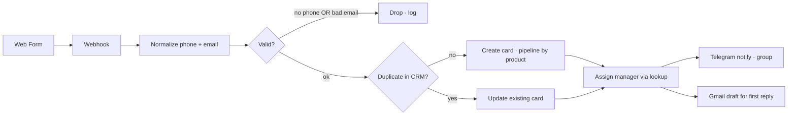

# 05 — Lead Intake Automation

Обработка заявок с веб-форм: автоматический ввод в CRM в первые секунды, нормализация и валидация,
отсев мусора, маршрутизация по продукту, уведомление в Telegram и черновик письма в Gmail.

**Стек:** Albato / Make · amoCRM · Bitrix24 · Telegram Bot API · Gmail API · Webhooks

---

## Задача

Менеджеры онлайн-школы вручную переносят заявки с лендингов в CRM, ищут дубли, разносят по продуктам.
Это съедает 2–3 часа в день и создаёт окно «холодного лида» — пока заявку обработают, клиент
уже у конкурента.

Цели:
- Заявка попадает в CRM **за секунды**, а не часы.
- Никаких дублей: если клиент уже есть — обновляется его карточка, не создаётся новая.
- Заявка автоматически попадает в **правильную воронку** по продукту, без ручной диспетчеризации.
- Ответственный назначается по правилам, а не «кто первый увидел».

---

## Архитектура

| Шаг | Что делает |
|---|---|
| Webhook | Принимает payload от веб-формы (Tilda / самописный лендинг / Typeform) |
| Normalize | Приводит телефон к единому формату (+7-XXX-XXX-XX-XX), валидирует email |
| Validation | Отсеивает мусор: нет телефона или email без «@» — drop с логом |
| Dedup check | Поиск в CRM по нормализованному телефону и email |
| Pipeline routing | По product-полю выбирается нужная воронка (lookup-таблица: product → pipeline_id / stage_id) |
| Manager assignment | По service-полю выбирается ответственный (lookup-таблица: service → manager_id) |
| Telegram notify | В групповой чат менеджеров уходит уведомление со ссылкой на сделку и ключевыми полями |
| Gmail draft | Формируется черновик первого письма для быстрого ручного отправления |

---

## Архитектурные решения

| Решение | Почему |
|---|---|
| **Albato / Make вместо n8n** | Бóльшая часть кастомных Webhook'ов уже была настроена через Albato. Для прямолинейной задачи «форма → CRM» — это быстрее и не требует selfhosted-инфры. n8n используется там, где нужна сложная логика и async. |
| **Lookup-таблицы вместо if-цепочек** | Список продуктов и менеджеров меняется часто. Lookup-таблицу могут править операционщики, не разработчики. |
| **Поиск дублей по двум полям (phone + email)** | Клиент может оставить заявку с одним email и разными телефонами или наоборот. Двойная проверка снижает количество дублей до близкого к нулю. |
| **Gmail draft, не auto-send** | Первое письмо клиенту — точка контакта. Менеджер дочитывает и отправляет, а не AI «от имени менеджера». |
| **Telegram алерт + сделка в CRM одновременно** | Менеджер видит уведомление сразу, не залогинившись в CRM. Но запись в CRM есть всегда, по логам можно убедиться что ничего не пропало. |

---

## Влияющие факторы (для оценки сложности)

- Количество форм и линеек продуктов
- Тип интеграций (готовые модули в Albato/Make vs прямой API)
- Глубина валидации (только наличие полей vs нормализация по справочнику городов и т.п.)
- Сложность маршрутизации (одна воронка vs матрица «продукт × сегмент клиента»)
- Каналы уведомлений (только Telegram vs Telegram + Slack + Gmail + SMS)
