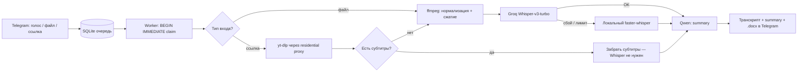

# 06 — Transcribe Bot для команды

Внутренний Telegram-бот: принимает голос, аудио, видео или ссылку
(YouTube, TikTok, облачный диск) и возвращает текстовую расшифровку
с кратким summary. Гибридный STT с fallback, очередь на SQLite, защита сервера от перегрузки.

**Стек:** Python · python-telegram-bot · faster-whisper (local) + Groq Whisper-v3-turbo · Qwen (ModelScope) · SQLite · yt-dlp + residential proxy · ffmpeg · systemd

---

## Задача

Команде контент-маркетинга нужно было быстро превращать длинные созвоны,
голосовые и чужие видео-ролики в текст, не тратя время на ручную расшифровку. Требования:
- один вход на всё — голос, файл, ссылка на ролик;
- работать на дешёвом облачном сервере, который YouTube активно блокирует;
- не падать на длинных видео и не забивать диск;
- если один движок распознавания недоступен — не терять задачу, а доделать её другим.

---

## Архитектура

Бот принимает задачу, кладёт её в очередь и обрабатывает в фоне. Тяжёлая распознавалка
вынесена из обработчика сообщений, чтобы Telegram не упирался в таймаут.

### Очередь и claim

Задачи живут в SQLite. Worker забирает их атомарно через `BEGIN IMMEDIATE` —
два параллельных воркера не возьмут одну и ту же задачу. Это держит конкурентность
под контролем на одном сервере без брокера сообщений.

### Subs-first

Прежде чем запускать распознавание, бот проверяет, есть ли у видео готовые субтитры.
Если есть — забирает их напрямую и **полностью обходит Whisper**: вместо тяжёлого
скачивания и распознавания (десятки секунд, сотни МБ диска) задача закрывается за пару секунд.

### Гибридный STT с fallback

Основной движок — Groq Whisper-v3-turbo (быстро, ~17× realtime). При сбое или упоре
в лимит задача автоматически уходит на локальный `faster-whisper` на сервере,
а админу прилетает алерт о деградации. Задача не теряется ни при каком исходе.

---

## Архитектурные решения

| Решение | Почему |
|---|---|
| Очередь на SQLite + `BEGIN IMMEDIATE` | Атомарный claim задачи без отдельного брокера. Конкурентность под контролем на одном VPS. |
| Распознавание вынесено из обработчика сообщений | Telegram-хендлер отвечает мгновенно и не упирается в таймаут на длинных файлах. |
| Subs-first до Whisper | Большая часть роликов уже имеет субтитры — незачем тратить CPU, трафик и диск на распознавание. |
| Hybrid STT: облачный Groq + локальный fallback | Скорость в обычном режиме, отказоустойчивость при лимитах/сбоях. Задача доделывается всегда. |
| Residential proxy для yt-dlp | Облачный IP сервера блокируется YouTube; резидентный прокси решает это без возни с cookies. |
| Pre-flight disk check + ffmpeg-сжатие + auto-cleanup | Защита маленького сервера: не скачать больше, чем влезет; сжать под лимит API; убрать за собой. |
| Алерт админу на каждый fallback/сбой | Деградация видна сразу, а не постфактум по «бот стал медленным». |

---

## Что показывает

- Проектирование **надёжного пайплайна** на одном дешёвом сервере: очередь, атомарный claim, fallback-ветки.
- **Cost/perf-инжиниринг**: subs-first и гибридный STT экономят и время, и деньги, и диск.
- Решение **инфраструктурных болей** (bot-detection, лимиты API, переполнение диска), а не только «вызвать модель».
