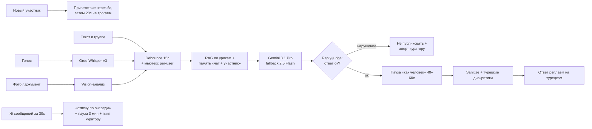

# 07 — AI-куратор турецкоязычного сообщества

Telegram-бот-куратор для турецкоязычного wellness-клуба (онлайн-школа).
Общается с участниками прямо в группе по-турецки, а куратора ведёт по-русски в личке.
Приветствия новичков, голос и фото, RAG по урокам, модерация ответов через LLM-судью,
человекоподобные паузы, антифлуд и долгосрочная память по каждому участнику.

**Стек:** TypeScript · grammY · Google Gemini 3.1 Pro (Vertex AI) + Gemini 2.5 Flash fallback · better-sqlite3 + sqlite-vec (RAG / память) · Groq Whisper-v3 (голос) · node-cron · pino · systemd

---

## Задача

Живому куратору тяжело быть в группе 24/7 и отвечать каждому на турецком. Нужен бот, который:

- отвечает участникам **на турецком** в стиле живого куратора, а не «робота»;
- не путается, кто есть кто — память по каждому человеку отдельно, даже при одинаковых именах;
- сам себя бережёт при наплыве сообщений и не спамит группу;
- проверяет собственные ответы на соответствие правилам сообщества до публикации;
- работает с голосом и фото так же, как с текстом;
- зовёт живого куратора, когда ситуация выходит за рамки.

---

## Архитектура

Каждое сообщение проходит через буфер, единый AI-пайплайн и гейт модерации. Тяжёлая
генерация вынесена так, чтобы группа не «зависала» в ожидании, а ответ выглядел человеческим.

### Дебаунс и конкурентность

Участники часто пишут очередью коротких сообщений («привет», «у меня вопрос», «про 5 шагов»).
Бот ждёт **15 секунд тишины** (но не дольше 30 секунд от первого сообщения), склеивает их в один
контекст и отвечает одним сообщением. Поверх дебаунса — **мьютекс на каждого участника**, чтобы
параллельные сообщения не запускали два AI-вызова на одного человека.

### Человекоподобные паузы

Мгновенный ответ сразу выдаёт бота. Поэтому ответ приходит через **40–60 секунд**: пара секунд
«печатает…», затем пауза, затем генерация. Между двумя своими ответами в одном чате бот держит
минимум 10 секунд. Это не задержка-баг, а дизайн «живого куратора».

### Память

Две памяти: **короткая** (последние ~15 реплик диалога для связности) и **долгая** (факты о человеке —
имя, предпочтения, контекст). Память **изолирована по паре «чат + участник»**: одно имя в разных группах =
разные памяти, бот не смешивает людей. Хранение и векторный поиск — на SQLite + sqlite-vec, без внешней БД.

### Модерация через LLM-судью

Перед публикацией ответ проходит **reply-judge** — отдельную проверку на соответствие правилам
сообщества. Сомнительный ответ не публикуется, а уходит сигналом живому куратору.

---

## Архитектурные решения

| Решение | Почему |
|---|---|
| Debounce-буфер 15с + мьютекс per-user | Участники пишут очередями; склеиваем в один ответ и не запускаем параллельные AI-вызовы на одного человека. |
| Человекоподобные паузы (40–60с) by design | Мгновенный ответ выдаёт бота; «печатает…» + задержка держат ощущение живого куратора. |
| Память изолирована по паре «чат + участник» | Одно имя в разных группах = разные памяти; бот не путает участников. |
| Reply-judge до публикации | LLM-судья отсекает ответы, нарушающие правила сообщества, ещё до отправки. |
| Модель с fallback + ротация ключей | При лимите/сбое основной модели ответ доделывает запасная; ротация ключей против 429. |
| Антифлуд со self-throttle + эскалация | В «шторм» бот не спамит, отвечает по очереди и зовёт живого куратора. |
| Голос и фото → единый текстовый пайплайн | Один путь обработки для любого типа входа, меньше дублирования логики. |
| Sanitize + whitelist ссылок на выходе | Бот не публикует ссылки вне разрешённого списка. |

---

## Что показывает

- Проектирование **realtime-бота для живого сообщества**: батчинг сообщений, контроль конкурентности (мьютексы), управляемая задержка.
- **Многоязычный UX «как человек»**, а не «как робот» — паузы, приветствия, турецкие диакритики.
- **Модерацию AI** через связку LLM-судьи и детерминированных гейтов.
- **Отказоустойчивость**: fallback модели, ротация ключей, антифлуд и эскалация на живого куратора.
