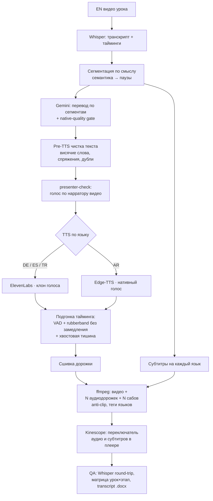

# 08 — Авто-дубляж видео-курсов (EN → TR / ES / DE / AR)

Пайплайн автоматической переозвучки видео-курсов онлайн-школы с английского на
**турецкий, испанский, немецкий и арабский** — голосом, близким к оригинальному спикеру,
с укладкой в исходный тайминг. На выходе — **видео с несколькими аудиодорожками и
субтитрами на каждом языке**, с переключателем озвучки и субтитров прямо в плеере.

**Стек:** Python · ffmpeg · Gemini 2.5 Pro (перевод + native-gate) · ElevenLabs IVC (клон голоса DE/ES/TR) · Edge-TTS (AR) · Chatterbox / F5-TTS (open-source TTS) · Whisper (транскрипция + QA round-trip) · WebRTC VAD + rubberband (тайминг) · Kinescope (мультидорожечный хостинг)

---

## Задача

Онлайн-школа сняла курсы на английском и хочет выпустить их сразу на четырёх языках. Ручной дубляж — это студия, дикторы, недели работы на каждый язык. Нужен автопайплайн, который:

- звучит **голосом, близким к оригинальному спикеру**, а не «роботом»;
- **укладывает перевод в исходный тайминг** — фраза не наезжает на следующую, паузы сохраняются;
- даёт зрителю **переключать язык озвучки и субтитров прямо в плеере**;
- собирается **пакетно по урокам** — курс это десятки видео, не по одному руками;
- проверяет результат **детерминированно**, а не «на слух».

---

## Архитектура

### Перевод с укладкой в ритм

Gemini переводит **посегментно**; отдельный native-gate проверяет, что перевод звучит
естественно для носителя. Сегментация работает по принципу **«сначала смысл, потом паузы»**:
фразы режутся по смыслу и укладываются в паузы оригинала, чтобы озвучка не наезжала на
следующую реплику. Перед синтезом текст проходит **чистку** (висячие слова, неверные
спряжения, обрывки, дубли) — иначе TTS «спотыкается».

### Голос по спикеру, а не один сэмпл на курс

`presenter-check` определяет нарратора **каждого видео** (если ведущих несколько — выбор) и
подбирает под него голос. DE/ES/TR — клон голоса через ElevenLabs (IVC); AR — Edge-TTS с
нативным арабским голосом. Open-source движки (Chatterbox / F5-TTS) — для тестов и кейсов,
где клон не нужен.

### Тайминг без «ускоренного» звука

Подгонка длительности — **VAD-aware сшивка + rubberband** без слышимого замедления: короткие
сегменты мягко растягиваются, длинные поджимаются, в хвост добавляется тишина, чтобы спикер
«договаривал» фразу и не обрывался на краю.

### Мультидорожечный выход

ffmpeg собирает **один видеофайл** с несколькими аудиодорожками (EN + TR/ES/DE/AR) и
субтитрами на каждом языке, чистит таймкод-дорожку (tmcd) и проставляет языковые теги.
После загрузки в Kinescope зритель переключает озвучку и субтитры **прямо в плеере** — не
нужно плодить по отдельному видео на язык.

### Контроль качества

`Whisper round-trip`: готовая озвучка распознаётся обратно в текст на целевом языке и
сравнивается с переводом — **детерминированная** проверка вместо «на слух». По каждому курсу
формируются матрица «урок × этап» и transcript `.docx` (EN + целевой язык) с таймингом.

---

## Архитектурные решения

| Решение | Почему |
|---|---|
| Сегментация «смысл → паузы» | Перевод укладывается в исходный ритм и не наезжает на следующую фразу. |
| Голос по нарратору каждого видео | Один сэмпл на курс звучит чужим при смене ведущего; по-нарраторно — ближе к оригиналу. |
| Pre-TTS чистка текста | Висячие слова и обрывки заставляют TTS «спотыкаться» — чистим до синтеза. |
| rubberband без замедления вместо простого atempo | Подгонка длительности без слышимого «замедленного» звука. |
| Whisper round-trip как ground-truth | Оценка «на слух» и LLM-судья галлюцинируют; обратное распознавание — детерминированный контроль. |
| Гибрид TTS: ElevenLabs клон + Edge / open-source | Клон голоса там, где критично; нативный/бесплатный движок там, где достаточно — баланс цены и качества. |
| Мультидорожка в Kinescope | Один файл, переключение языка и субтитров в плеере — без зоопарка «видео на язык». |
| Пакетная обработка по урокам + RAM-guard | Курс — десятки видео; батч с контролем памяти, чтобы не положить сервер. |

---

## Что показывает

- Сложный медиа-пайплайн **end-to-end**: ASR → перевод → клон голоса → подгонка тайминга → мукс → доставка.
- **Инжиниринг качества**: детерминированный QA (round-trip), а не «на слух».
- **Баланс цена/качество** в выборе TTS и продуманный UX (переключатель языков в плеере).
- Работа с **арабским** (RTL, диакритика, нативный голос) наравне с европейскими языками.
