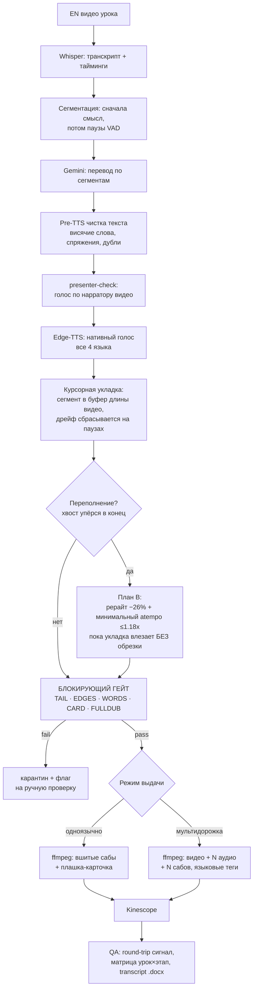

# 08 — Авто-дубляж видео-курсов (EN → TR / ES / DE / AR)

Пайплайн автоматической переозвучки видео-курсов онлайн-школы с английского на
**турецкий, испанский, немецкий и арабский** — нативным неросетевым голосом, подобранным
под нарратора каждого видео, с укладкой перевода в исходный тайминг. Два режима выдачи:
**одноязычное видео с вшитыми субтитрами** и **мультидорожечное видео** (EN + N озвучек + N
субтитров с переключателем прямо в плеере).

Главный инвариант, на котором держится весь пайплайн: **длина озвученной дорожки равна
длине видео, а закрывающие фразы НИКОГДА не обрезаются механически под хронометраж.**

**Стек:** Python · ffmpeg · Edge-TTS (нативный неросетевой голос, все 4 языка) ·
Gemini 2.5 Pro (перевод + «второе ухо» по флагам) · Qwen3 (бесплатный independent meaning-check) ·
Whisper (транскрипт + round-trip QA как сигнал) · WebRTC VAD (паузы/сегментация) ·
курсорная укладка + точечный atempo (тайминг) · Kinescope (мультидорожечный хостинг)

---

## Задача

Онлайн-школа сняла курсы на английском и хочет выпустить их сразу на четырёх языках. Ручной дубляж — это студия, дикторы, недели работы на каждый язык. Нужен автопайплайн, который:

- звучит **нативным голосом, подобранным под нарратора**, а не «роботом»;
- **укладывает перевод в исходный тайминг** — фраза не наезжает на следующую, паузы сохраняются;
- **гарантирует, что концовку не срежет** — длина аудио строго равна длине видео, и при этом ни одна закрывающая фраза не теряется;
- даёт зрителю **переключать язык озвучки и субтитров прямо в плеере** (либо отдаёт одноязычный ролик с вшитыми сабами);
- собирается **пакетно по урокам** — курс это десятки видео, не по одному руками;
- **не пропускает брак**: процесс на 90% автоматический, люди смотрят выборочно, поэтому перед заливкой стоит блокирующий гейт.

---

## Архитектура

### Перевод с укладкой в ритм

Сегментация работает по принципу **«сначала смысл, потом паузы»**: фразы режутся по смыслу и
ложатся в паузы оригинала, чтобы озвучка не наезжала на следующую реплику. Gemini переводит
**посегментно**. Перед синтезом текст проходит **чистку** (висячие слова, неверные спряжения,
обрывки, дубли) — иначе TTS «спотыкается».

### Голос по нарратору, а не один сэмпл на курс

`presenter-check` определяет нарратора **каждого видео** (если ведущих несколько — выбор) и
подбирает под него нативный неросетевой голос Edge-TTS (пол/характер под спикера). Это
**подбор голоса**, а не клон реального диктора: для курсового дубляжа важнее стабильный,
предсказуемый тембр без дрейфа между уроками и нулевая стоимость синтеза, чем точная имитация.
Edge-TTS даёт нативное произношение на всех четырёх языках, включая арабский.

### Курсорная укладка + строгий запрет обрезки концовки

Это ядро тайминга и главное инженерное решение. Озвучка кладётся в буфер **точной длины
видео**: каждый сегмент ставится в `max(старт по оригиналу, конец предыдущего)`, дрейф
**сбрасывается на каждой паузе**, так что рассинхрон не копится по всему ролику. Если у
быстрого ролика без пауз хвост **упирается в конец видео**, наивная укладка просто срезала бы
закрывающие фразы — это считается **браком**.

Вместо обрезки включается **План B**: аккуратный рерайт оригинального текста (−26%) плюс
**минимальный** глобальный atempo (бинарный поиск, потолок ускорения 1.18×) — ровно столько,
чтобы естественная озвучка влезла под хронометраж **без единого обрезанного слова**. Якоря
старта по оригиналу фиксированы, поэтому начало остаётся синхронным.

### Потолок ускорения — по данным, не на глаз

Потолок atempo в Плане B (1.18×) — не угаданная константа, а откалиброванная по логам
реального прогона. На немецком курсе (немецкий длиннее из-за артиклей → переполняется чаще
европейских) из 41 урока 34 задействовали План B; замер реально применённого ускорения
показал, что верхние 3% (15→18%) использовали **~29% видео**, и ни одно не превысило 18%.
Потолок стоит ровно там, где его используют: ниже — часть уроков ушла бы в лишний дорогой
рерайт, выше — незачем. Тот же замер (поле `global atempo` в логах) — регламент калибровки
потолка на новом языке.

### Блокирующий гейт качества (брак не уходит в выдачу)

Процесс на 90% авто — переводчики смотрят выборочно только то, что гейт пометил. Поэтому
перед заливкой каждое видео проходит **блокирующую проверку по реальным сшитым артефактам**
(финальный mp4 + дорожка + укладка). Не прошёл — **карантин и флаг на ручную проверку**, а не
тихая отметка «готово». Проверки:

- **FULLDUB** — пересчитывает естественную укладку **из реально озвученного материала** (фактические аудио-сегменты + якоря) и сверяет с длиной видео. Длина дорожки всегда подогнана под видео, поэтому простое сравнение длительностей доказывало бы пустоту — а эта проверка ловит именно **механический срез концовки**, которого совпадение длительностей не видит.
- **TAIL** — в укладке нет ни одного «зажатого» в конец сегмента (нулевой clamp).
- **EDGES** — на реальной дорожке есть речь в первые и последние ~2.5 с (ловит обрезанный/пустой старт или конец).
- **WORDS** — Whisper по финалу даёт ≥ 0.62× ожидаемых слов (грубый отлов потери контента).
- **CARD** — регион субтитровой плашки в финале отличается от мастера (плашка реально вшита, а не молча пропущена).

### «Второе ухо» с гардом от само-противоречия

Round-trip и LLM-судья **шумят** (особенно Whisper недослышивает короткие арабские служебные
слова), поэтому они — **сигнал, а не вердикт**. На помеченные cue (низкий round-trip) Gemini
слушает **только подозрительные слайсы** — не весь трек, иначе курс на этом захлебнулся бы.
Поверх стоит **гард от само-противоречия**: если Gemini ставит `critical`, но независимая
**бесплатная** проверка смысла (Qwen3) подтверждает, что смысл сохранён (выпало лишь
служебное слово), вердикт понижается до `suspect` — всё ещё показывается человеку, но не
блокирует. **Аудио-дефекты** (клиппинг, заикание, обрыв) при этом **никогда не понижаются** —
глитч реален, даже если слова верные.

### Бюджетная маршрутизация моделей

Дешёвое — дешёвыми инструментами, дорогую модель — только где она нужна. Сначала
**детерминированные** проверки (ffprobe-длительности, RMS по краям, счётчик слов Whisper) —
они и есть блокирующий гейт. LLM-«ухо» (Gemini) дёргается **только** по флагам round-trip, а
не на каждый сегмент. Независимый meaning-check — на **бесплатном** Qwen3. Так контроль
качества масштабируется на десятки видео без взрыва стоимости.

Тот же приём — отдельным **faithfulness-скрином** по каждому уложенному сегменту, единообразно
на всех четырёх языках: детерминированный $0-фильтр (пропавшее из перевода число, подозрительно
короткий перевод) → эскалация **только флагнутых** сегментов в бесплатный Qwen3 на бинарный
«смысл сохранён?». Чистые сегменты до модели не доходят — сигнал для выборочной ручной
проверки, не блок.

### Два режима выдачи

- **Одноязычное видео** — перевод вшивается дорожкой + субтитры жёстко в кадр (плашка-карточка), отдельный ролик на язык. Удобно, когда хостинг без мультидорожки.
- **Мультидорожка** — ffmpeg собирает один файл (EN + TR/ES/DE/AR аудио + субтитры на каждый язык), чистит таймкод-дорожку (tmcd) и проставляет языковые теги; после загрузки в Kinescope зритель переключает озвучку и субтитры **прямо в плеере**.

Вид субтитров выбирается пресетом перед прогоном — три именованных стиля: вшитый «MBF White»
(Noto Sans, тонкая обводка, без бокса), мягкие динамические сабы Kinescope для мультидорожки
(стиль рисует плеер, мы управляем разбиением на короткие плывущие чанки) и кремовая
субтитровая карточка для одноязычного арабского.

### Контроль качества по курсу

По каждому курсу формируются **матрица «урок × этап»** (где жёсткие этапы исключают шумный
round-trip-сигнал) и **transcript `.docx`** (EN + целевой язык) с таймингом по урокам.
Главный агент раз в прогон сверяет матрицу, подтверждает чистый набор и эскалирует
помеченные видео человеку.

---

## Архитектурные решения

| Решение | Почему |
|---|---|
| Сегментация «смысл → паузы» | Перевод укладывается в исходный ритм и не наезжает на следующую фразу. |
| Голос по нарратору каждого видео | Один сэмпл на курс звучит чужим при смене ведущего; подбор по-нарраторно — ближе к оригиналу. |
| Edge-TTS (нативный голос) вместо клона | Стабильный тембр без дрейфа между уроками, нативное произношение на 4 языках, нулевая стоимость синтеза. |
| Pre-TTS чистка текста | Висячие слова и обрывки заставляют TTS «спотыкаться» — чистим до синтеза. |
| Курсорная укладка с дрейфом, сбрасываемым на паузах | Рассинхрон не копится по ролику; сегменты ложатся в естественные паузы оригинала. |
| План B (рерайт + минимальный atempo) вместо обрезки концовки | Жёсткий инвариант: длина аудио = видео, но ни одна закрывающая фраза не теряется. |
| Блокирующий гейт с FULLDUB по реальному материалу | В 90%-авто процессе брак не должен пройти; FULLDUB ловит механический срез, который совпадение длительностей прячет. |
| Round-trip / LLM-судья как сигнал, не блок | Оценка «на слух» и LLM-судья галлюцинируют; детерминированные проверки гейтят, LLM — только подсказка. |
| Гард от само-противоречия на «ухе» | Понижает ложные critical при сохранённом смысле, но никогда не прощает реальный аудио-дефект. |
| Бюджетная маршрутизация моделей | Дёшево детерминированными чеками, дорогая модель — только по флагам; QA масштабируется без взрыва цены. |
| Потолок atempo откалиброван по логам прогона | Константа не угадана: 1.18× стоит там, где его реально используют (~29% немецких уроков), выше — незачем; замер `global atempo` — регламент для нового языка. |
| Faithfulness-скрин на всех языках (детерминир. → free Qwen3) | Единый бюджетный контроль смысла по сегментам: дешёвый фильтр отсеивает чистое, платит только за подозрительное. |
| Мультидорожка в Kinescope + одноязычный burned-режим | Один файл с переключателем языка — либо одиночный ролик с вшитыми сабами, под разный хостинг. |
| Пакетная обработка по урокам + RAM-guard | Курс — десятки видео; батч с контролем памяти, чтобы не положить сервер. |

---

## Что показывает

- Сложный медиа-пайплайн **end-to-end**: ASR → сегментация → перевод → нативный TTS → курсорная укладка → блокирующий гейт → мукс → доставка.
- **Инжиниринг качества, а не отчёт постфактум**: блокирующий гейт с проверкой по реально озвученному материалу — брак физически не уходит в выдачу.
- **Строгий инвариант** «длина аудио = длине видео, концовка не обрезается» с автоматическим планом B вместо механического среза.
- **Бюджетная маршрутизация моделей**: детерминированные проверки + дорогая модель только по флагам + бесплатный independent meaning-check.
- Работа с **арабским** (RTL, диакритика, нативный голос, слабость ASR на коротких словах) наравне с европейскими языками.
